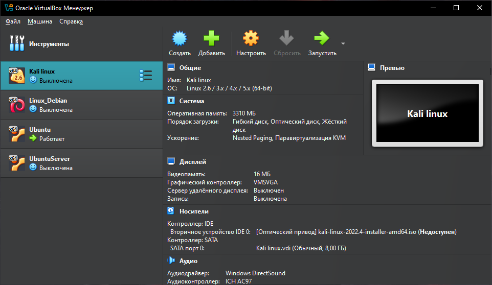

# Task_Server_C запуск на Линукс

## В разработке использовались
- [**Oracle VirtualBox**](https://www.virtualbox.org/wiki/Downloads) - виртуальная машина
- [**Ubuntu**](https://ubuntu.com/download) - дистрибутив GNU/Linux
- Язык `C++`
- Брокер сообщений `NATS JetStream`

## Установка

Скачиваем **Ubuntu**, **Oracle VirtualBox** и устанавливаем

В окне программы нажимаем **Создать**

Даем и ВМ и выбираем скачанный нами образ  **Ubuntu**

