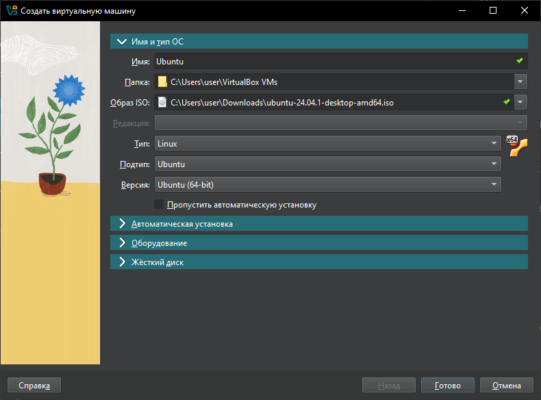

# Task_Server_C запуск на Линукс

## В разработке использовались
- [**Oracle VirtualBox**](https://www.virtualbox.org/wiki/Downloads) - виртуальная машина
- [**Ubuntu**](https://ubuntu.com/download) - дистрибутив GNU/Linux
- Язык `C++`
- Брокер сообщений `NATS JetStream`
- [**NATS**](https://docs.nats.io/running-a-nats-service/introduction/installation) -брокер сообщений, используемый для обмена данными между приложениями.

- [**OpenSSL**](https://wiki.openssl.org/index.php/Binaries) - библиотека для работы с SSL/TLS.
- [**MinGW**](https://www.mingw-w64.org/downloads/) - набор инструментов для разработки программного обеспечения.
- [**nats-server**](https://github.com/nats-io/nats-server/releases/?ysclid=m1iaiz9tdp658513633) - сервер NATS, используемый для обмена данными между приложениями.
## Установка Виртуальной машины

Скачиваем **Ubuntu**, **Oracle VirtualBox** и устанавливаем


В окне программы нажимаем **Создать**



Даем имя ВМ и выбираем скачанный нами образ  **Ubuntu**

Запускаем Виртуальную Машину

Главная страница


## Установка нужных библиотек

Скачиваем - [**nats-server**](https://github.com/nats-io/nats-server/releases/?ysclid=m1iaiz9tdp658513633) 

Добавляем **nats-server** в PATH
```
echo "export PATH=/home/admin1/nats-server:$PATH">>.bashrc
. .bashrc
```

Открываем командную строку

Устанавливаем нужные библиотеки

Пишем команды

```
sudo apt install cmake
```
```
git clone https://github.com/nats-io/cnats.git
cd cnats
mkdir build
cd build
cmake ..
cd ..
```
```
sudo apt install g++
```

## Запуск проекта
Коипруем проект с **github**
```
git clone https://github.com/Karver719/Task_Server_C.git
```
Переходим в папку проекта
```
cd Task_Server_C
```

Билдим приложения

```
g++ app1.cpp -o app1 -I/home/admin1/cnats -L/home/admin1/cnats/build/lib -lnats
```
```
g++ app2.cpp -o app2 -I/home/admin1/cnats -L/home/admin1/cnats/build/lib -lnats
```
Добавляем путь к библиотекам Linux

```
export LD_LIBRARY_PATH=/home/admin1/cnats/build/lib:$LD_LIBRARY_PATH
```
Запускаем **nats-server**
```
nats-server
```

Запускаем приложение 1 и 2

```
'/home/admin1/Task_Server_C/app1'
```
```
'/home/admin1/Task_Server_C/app2'
```


